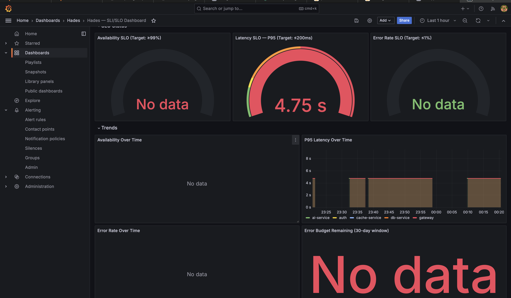
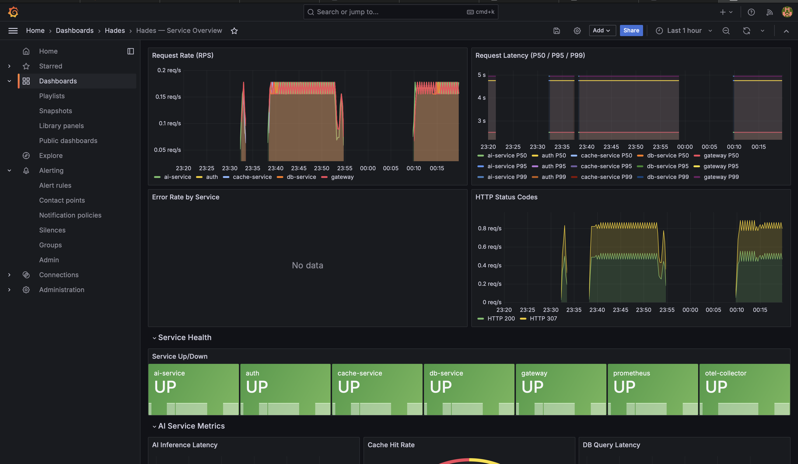
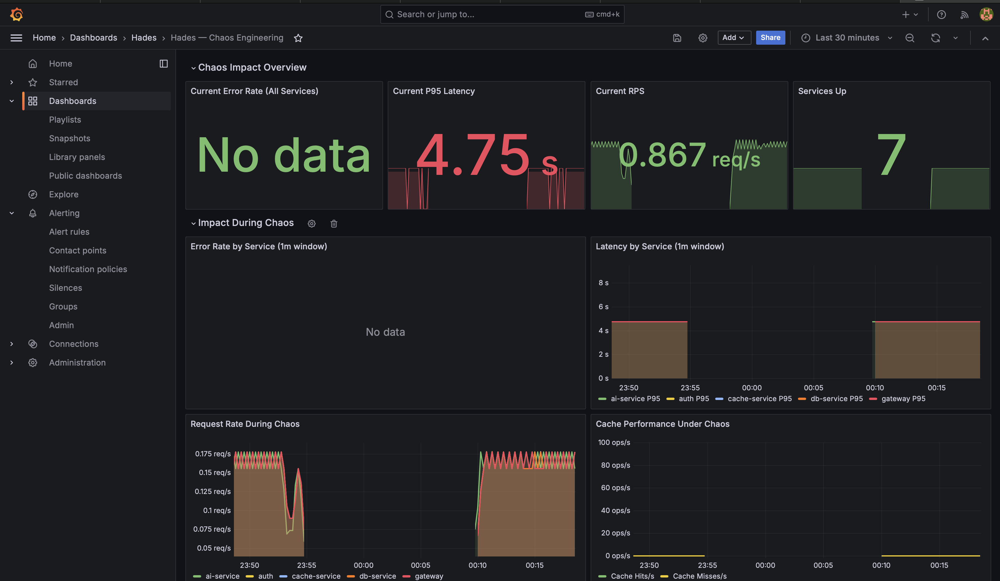

# 🔱 Project Hades

**AI Service Reliability Platform with OpenTelemetry**

A distributed microservices platform demonstrating Site Reliability Engineering (SRE) best practices — observability, chaos engineering, and SLI/SLO monitoring — built with FastAPI, OpenTelemetry, Prometheus, Grafana, and Docker.

---

## 📋 Table of Contents

- [Overview](#overview)
- [Architecture](#architecture)
- [Tech Stack](#tech-stack)
- [Quick Start](#quick-start)
- [Services](#services)
- [Observability](#observability)
- [Monitoring Dashboards](#monitoring-dashboards)
- [Chaos Engineering](#chaos-engineering)
- [API Reference](#api-reference)
- [SLO Targets](#slo-targets)
- [Testing](#testing)
- [Project Structure](#project-structure)

---

## Overview

Project Hades simulates a real-world AI application with end-to-end visibility into:

- **Request flow** across 5 microservices
- **System performance** via metrics, traces, and structured logs
- **Failure behavior** through chaos engineering experiments
- **Reliability tracking** with SLI/SLO dashboards and alerting

---

## Architecture

```
                                    ┌─────────────────────────────────────────┐
                                    │         Observability Stack             │
                                    │                                         │
                                    │  ┌───────────┐  ┌───────┐  ┌────────┐  │
                                    │  │Prometheus  │  │ Tempo │  │  Loki  │  │
                                    │  │  :9090     │  │ :3200 │  │ :3100  │  │
                                    │  └─────┬─────┘  └───┬───┘  └───┬────┘  │
                                    │        │            │           │       │
                                    │        └──────┬─────┴───────────┘       │
                                    │               │                         │
                                    │        ┌──────┴──────┐                  │
                                    │        │   Grafana   │                  │
                                    │        │    :3000    │                  │
                                    │        └─────────────┘                  │
                                    └──────────────▲──────────────────────────┘
                                                   │
                                          ┌────────┴────────┐
                                          │  OTEL Collector  │
                                          │   :4317/:4318   │
                                          └────────▲────────┘
                                                   │
                         traces/metrics/logs       │
                    ┌──────────┬───────────┬───────┴────┬──────────┐
                    │          │           │            │          │
              ┌─────┴────┐ ┌──┴───┐ ┌─────┴─────┐ ┌───┴────┐ ┌──┴──────┐
 Client ───▶ │ Gateway  │→│ Auth │→│ AI Service│→│   DB   │ │  Cache  │
              │  :8000   │ │:8001 │ │   :8002   │ │ :8003  │ │  :8004  │
              └──────────┘ └──────┘ └───────────┘ └───┬────┘ └────┬────┘
                                                      │           │
                                                 ┌────┴───┐  ┌───┴───┐
                                                 │ SQLite │  │ Redis │
                                                 └────────┘  │ :6379 │
                                                              └───────┘
                    ┌──────────────┐
                    │    Chaos     │ ──── controls all services
                    │  Controller  │
                    │    :8005     │
                    └──────────────┘
```

### Request Flow

```
1. Client sends request ──▶ Gateway (:8000)
2. Gateway authenticates ──▶ Auth Service (:8001)
3. Auth validates & returns ──▶ Gateway
4. Gateway forwards ──▶ AI Service (:8002)
5. AI Service checks ──▶ Cache Service (:8004)
   ├── Cache HIT ──▶ return cached result
   └── Cache MISS ──▶ query DB Service (:8003)
       └── Run inference ──▶ store in Cache ──▶ return result
6. Every service emits traces, metrics, logs ──▶ OTEL Collector
```

---

## Tech Stack

| Layer | Technology |
|-------|-----------|
| **Services** | Python 3.12, FastAPI, httpx (async), Pydantic |
| **Database** | SQLite (via aiosqlite) |
| **Cache** | Redis 7 |
| **Tracing** | OpenTelemetry SDK → Grafana Tempo |
| **Metrics** | OpenTelemetry + Prometheus |
| **Logging** | structlog (JSON) → Loki via Promtail |
| **Dashboards** | Grafana (3 pre-provisioned dashboards) |
| **Chaos** | Custom chaos controller with fault injection |
| **Orchestration** | Docker Compose (13 containers) |
| **Load Testing** | Locust |

---

## Quick Start

### Prerequisites

- [Docker Desktop](https://www.docker.com/products/docker-desktop/) (running)
- `make` (pre-installed on macOS/Linux)

### Launch

```bash
# Start the entire platform
make up

# Verify all services are healthy
make health

# Send a test request through the pipeline
make test

# Open Grafana dashboards
make open-grafana
# Login: admin / hades
```

### Generate Traffic for Dashboards

```bash
# Generate steady-state traffic (populates dashboards with data)
make traffic
# Press Ctrl+C to stop
```

### Run Chaos Experiments

```bash
# List available scenarios
make chaos-scenarios

# Run a chaos scenario
make chaos-start SCENARIO=cascading-failure

# Run the full chaos demo
./scripts/run_chaos_demo.sh

# Stop all chaos
make chaos-stop
```

### Tear Down

```bash
make down        # Stop containers
make clean       # Remove containers, volumes, and images
```

---

## Services

### Gateway Service (`:8000`)
Entry point for all client requests. Routes to Auth for validation, then forwards to AI Service for processing.

| Endpoint | Method | Description |
|----------|--------|-------------|
| `/api/v1/process` | POST | Main processing endpoint |
| `/health` | GET | Health check |
| `/ready` | GET | Readiness (checks downstream services) |
| `/metrics` | GET | Prometheus metrics |

### Auth Service (`:8001`)
Simulates authentication via API keys and bearer tokens.

| Endpoint | Method | Description |
|----------|--------|-------------|
| `/auth/validate` | POST | Validate API key or token |
| `/auth/token` | POST | Issue a demo token |

**Demo credentials:** API keys `hades-key-001` through `003`, tokens `hades-token-001` through `003`

### AI Service (`:8002`)
Simulated ML inference with configurable latency. Checks cache first, falls back to DB, runs inference, caches the result.

| Endpoint | Method | Description |
|----------|--------|-------------|
| `/ai/process` | POST | Process input through AI pipeline |
| `/ai/models` | GET | List available models |

**Models:** `default` (~100ms), `fast` (~50ms), `deep` (~200ms)

### DB Service (`:8003`)
SQLite-backed key-value store, pre-seeded with model configurations and sample data.

| Endpoint | Method | Description |
|----------|--------|-------------|
| `/db/query` | POST | Query by key |
| `/db/store` | POST | Store a record |
| `/db/delete/{key}` | DELETE | Delete a record |

### Cache Service (`:8004`)
Redis-backed caching layer with configurable TTL (default: 300s).

| Endpoint | Method | Description |
|----------|--------|-------------|
| `/cache/get` | POST | Get cached value |
| `/cache/set` | POST | Set value with TTL |
| `/cache/invalidate/{key}` | DELETE | Invalidate entry |
| `/cache/flush` | POST | Clear all entries |

---

## Observability

### Distributed Tracing
Every request generates a **trace** that propagates across all services:

```
Gateway Span
├── Auth Span (validate credentials)
├── AI Service Span
│   ├── Cache Lookup Span
│   ├── DB Query Span
│   ├── Inference Span
│   ├── Cache Store Span
│   └── DB Store Span
```

Traces flow: **Services → OTEL Collector → Tempo → Grafana**

### Metrics
Each service exposes metrics at `/metrics`, scraped by Prometheus every 15s:

| Metric | Type | Description |
|--------|------|-------------|
| `http_requests_total` | Counter | Total requests by service, method, status |
| `http_request_duration_seconds` | Histogram | Request latency distribution |
| `http_errors_total` | Counter | Error count by service |
| `ai_inference_duration_seconds` | Histogram | AI inference latency by model |
| `cache_hits_total` / `cache_misses_total` | Counter | Cache performance |
| `db_query_duration_seconds` | Histogram | Database query latency |

### Structured Logging
All logs are JSON-formatted with trace correlation:

```json
{
  "event": "request_completed",
  "service": "gateway",
  "trace_id": "a1b2c3d4e5f6...",
  "span_id": "1a2b3c4d...",
  "method": "POST",
  "path": "/api/v1/process",
  "status_code": 200,
  "duration_ms": 142.35,
  "timestamp": "2026-03-23T10:15:30.123Z"
}
```

Logs flow: **Container stdout → Promtail → Loki → Grafana**

---

## Monitoring Dashboards

Access Grafana at **http://localhost:3000** (login: `admin` / `hades`)

Three dashboards are auto-provisioned under the **Hades** folder:

### 1. SLI/SLO Dashboard

Tracks compliance against defined Service Level Objectives with real-time gauges and trend lines.



| Panel | What it shows |
|-------|-------------|
| **Availability Gauge** | Real-time availability % with color-coded thresholds (target: ≥99%) |
| **P95 Latency Gauge** | 95th percentile latency against 200ms SLO |
| **Error Rate Gauge** | Current error rate against 1% SLO |
| **Error Budget** | Remaining error budget over 30-day window |
| **Trend Lines** | Availability, latency, and error rate over time per service |

### 2. Service Overview Dashboard

Operational view across all microservices — request rates, latency percentiles, error breakdowns, and service health.



| Panel | What it shows |
|-------|-------------|
| **Request Rate** | RPS per service over time |
| **Latency Percentiles** | P50 / P95 / P99 per service |
| **Error Rate** | Error breakdown by service |
| **HTTP Status Codes** | Stacked 2xx / 4xx / 5xx distribution |
| **Service Health** | UP/DOWN status for all Prometheus targets |
| **AI Inference Latency** | Model-specific inference timing (default / fast / deep) |
| **Cache Hit Rate** | Cache effectiveness gauge (hits vs misses) |
| **DB Query Latency** | Database performance by operation type |

### 3. Chaos Engineering Dashboard

Real-time impact monitoring during chaos experiments — observe how faults propagate across services.



| Panel | What it shows |
|-------|-------------|
| **Error Rate (1m window)** | Fast-refresh error rate — shows chaos impact immediately |
| **P95 Latency (1m window)** | Narrow-window latency for real-time chaos visibility |
| **RPS** | Request throughput changes under fault injection |
| **Services Up** | Count of healthy services during experiments |
| **Cache Performance** | Cache hits vs misses (critical during cache-stampede scenario) |

---

## Chaos Engineering

### Chaos Controller (`:8005`)

| Endpoint | Method | Description |
|----------|--------|-------------|
| `/chaos/start` | POST | Start an experiment |
| `/chaos/stop/{target}` | POST | Stop experiment on a service |
| `/chaos/stop-all` | POST | Stop all active experiments |
| `/chaos/status` | GET | View active experiments |
| `/chaos/scenarios` | GET | List pre-defined scenarios |
| `/chaos/scenario/{name}` | POST | Run a named scenario |

### Pre-defined Scenarios

| Scenario | What it does |
|----------|-------------|
| `cascading-failure` | Injects 2s latency into DB → watch it propagate to AI → Gateway |
| `cache-stampede` | Forces cache errors → DB gets hammered with every request |
| `auth-outage` | Auth returns 503 → Gateway rejects all requests |
| `gradual-degradation` | AI service latency increases from 500ms to 5s |
| `multi-service-chaos` | Simultaneous faults across DB, Cache, and Auth |

### Fault Types

| Fault | Description |
|-------|-------------|
| **Latency** | Adds artificial delay (configurable ms) |
| **Error** | Returns error status code (configurable) |
| **Crash** | Raises unhandled exception |

### Example: Running a Chaos Experiment

```bash
# Via curl
curl -X POST http://localhost:8005/chaos/start \
  -H "Content-Type: application/json" \
  -d '{
    "target": "db-service",
    "fault_type": "latency",
    "probability": 0.8,
    "parameters": {"latency_ms": 2000},
    "duration_seconds": 60
  }'

# Via Makefile
make chaos-start SCENARIO=cascading-failure

# Watch the impact in Grafana, then stop
make chaos-stop
```

---

## API Reference

### Process a Request (Main Endpoint)

```bash
curl -X POST http://localhost:8000/api/v1/process \
  -H "Content-Type: application/json" \
  -H "X-API-Key: hades-key-001" \
  -d '{
    "input_data": "Analyze this text for sentiment",
    "model": "default",
    "use_cache": true
  }'
```

**Response:**
```json
{
  "request_id": "a1b2c3d4-...",
  "result": "{'model': 'hades-text-v1', 'classification': 'positive', 'confidence': 0.9231, ...}",
  "model": "default",
  "cached": false,
  "processing_time_ms": 142.35,
  "timestamp": "2026-03-23T10:15:30.123456"
}
```

---

## SLO Targets

| Metric | Target | Alert Threshold |
|--------|--------|----------------|
| **Availability** | ≥ 99% | < 99% for 2 minutes |
| **Latency (P95)** | ≤ 200ms | > 200ms for 2 minutes |
| **Error Rate** | ≤ 1% | > 1% for 2 minutes |

Alerts are defined in `observability/prometheus/alerts.yml` and visible in Grafana.

---

## Testing

```bash
# Integration tests (requires running stack)
make test-integration

# Load test with Locust (10 users, 30 seconds)
make test-load

# Single request test
make test

# Cache behavior test (sends same request twice)
make test-cached
```

---

## Project Structure

```
Project_Hades/
├── docker-compose.yml              # Orchestration (13 containers)
├── .env                            # Environment configuration
├── Makefile                        # Developer commands
│
├── shared/                         # Shared modules (copied into each service)
│   ├── telemetry.py                # OpenTelemetry initialization
│   ├── middleware.py               # Request timing, chaos injection
│   └── models.py                   # Pydantic request/response models
│
├── services/
│   ├── gateway/                    # :8000 — Entry point, routing
│   ├── auth/                       # :8001 — Authentication
│   ├── ai_service/                 # :8002 — Simulated ML inference
│   ├── db_service/                 # :8003 — SQLite key-value store
│   └── cache_service/              # :8004 — Redis cache layer
│
├── chaos/                          # :8005 — Chaos controller
│   ├── chaos_controller.py
│   └── Dockerfile
│
├── observability/
│   ├── otel-collector/             # Telemetry pipeline config
│   ├── prometheus/                 # Metrics + alert rules
│   ├── grafana/provisioning/       # Datasources + dashboards
│   ├── tempo/                      # Trace storage
│   ├── loki/                       # Log aggregation
│   └── promtail/                   # Log shipping
│
├── tests/
│   ├── integration/                # End-to-end + observability tests
│   └── load/locustfile.py          # Locust load tests
│
└── scripts/
    ├── generate_traffic.py         # Background traffic generator
    └── run_chaos_demo.sh           # Automated chaos demo
```

---

## Port Reference

| Port | Service |
|------|---------|
| 3000 | Grafana |
| 3100 | Loki |
| 3200 | Tempo |
| 4317 | OTEL Collector (gRPC) |
| 4318 | OTEL Collector (HTTP) |
| 6379 | Redis |
| 8000 | Gateway |
| 8001 | Auth |
| 8002 | AI Service |
| 8003 | DB Service |
| 8004 | Cache Service |
| 8005 | Chaos Controller |
| 8889 | OTEL Prometheus Exporter |
| 9090 | Prometheus |

---

<p align="center">Built with 🔱 by Project Hades</p>
